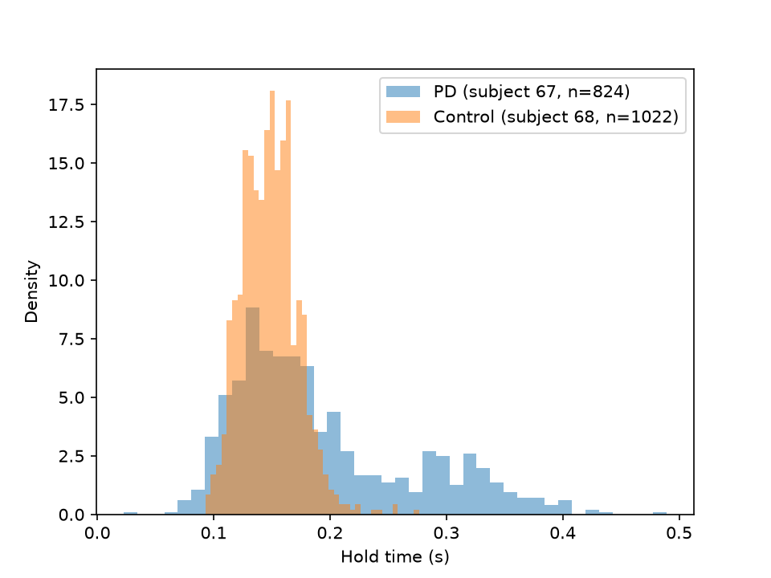

# Keystroke Dynamics for Parkinson's Disease Detection 

Passive detection of early Parkinson's disease (PD) from the timing of ordinary
typing, and an investigation of why classifiers that work on clinic-collected
data degrade on data collected at home.

**Research question:** Why does the keystroke signal for PD survive a clinic
setting but weaken in unsupervised, free-living collection?

**Status:** In progress. Data acquisition, format validation and a first
exploratory analysis are complete. Feature extraction, the baseline model and
the cross-dataset comparison are not started. See [Roadmap](#roadmap).

---

## Background

Fine motor control degrades early in PD, often before visible tremor. Typing is a
dense stream of timed finger movements, so keystroke timing can act as a passive
motor assessment that needs no wearable and no dedicated test.

Two timing features are the standard starting point:

| Feature | Definition |
|---|---|
| Hold time (HT) | Key press to key release |
| Flight time (FT) | Release of one key to press of the next |

The literature reports that hold-time features alone reach an AUC of roughly
0.81 on neuroQWERTY, above clinical finger-tapping tests. This repository first
tries to reproduce that baseline, then examines how it behaves on home-collected
data.

## Data

| Dataset | Subjects | Setting | Status |
|---|---|---|---|
| neuroQWERTY MIT-CSXPD | 85 (42 PD, 43 control) | Clinic study, free text | Downloaded, format validated |
| Tappy | 200+ | Home, unsupervised | Not yet downloaded |

Raw data is **not** committed to this repository. See
[`data/README.md`](data/README.md) for download instructions.

### neuroQWERTY structure

| Study folder | Subjects | PD | Sessions per subject |
|---|---|---|---|
| `MIT-CS1PD` | 31 | 18 | 2 |
| `MIT-CS2PD` | 54 | 24 | 1 |

Each study folder contains one CSV per typing session and a `GT_DataPD_*.csv`
file with the subject label (`gt`), the clinical motor score (`updrs108`), tapping
test results, and the session file names.

### Raw file format

One row per keystroke, comma-separated, no header, all times in seconds:

| Column | Meaning |
|---|---|
| 1 | Key name (quoted, for example `"e"`, `"space"`, `"Shift_L"`) |
| 2 | Hold time |
| 3 | Release time, relative to session start |
| 4 | Press time, relative to session start |

Validated on a sample file: `release - press` matches the stored hold time to
within 1e-4 s (rounding) on every row.

### Cleaning rules

Following the dataset authors' reference loader, a row is dropped when any of
the following holds:

- press or release time is not positive;
- hold time is negative or at least 5 s;
- press times go backwards (not yet implemented in this repository).

Modifier keys (Shift, Alt, Control) and mouse events are also removed. Without
this, Shift holds alone create the long tail of the hold-time distribution.

On one sample session, cleaning removed 1 of 1028 rows (0.10%) for timestamp
errors and 5 further rows for modifier keys. Removing those 5 rows (0.5%) reduced
the standard deviation of hold time from 0.063 s to 0.024 s. Drop rates across
the full dataset will be logged in `data/README.md` once the loader is complete.

## Preliminary observations

These come from a single PD subject (67) and a single control (68) with similar
typing speeds. They are hypotheses, not findings.



- The control shows one tight peak near 0.15 s (std 0.024 s). The PD subject has
  a higher median (0.169 s), a much wider spread (std 0.078 s) and a second
  cluster of long holds between about 0.25 and 0.40 s.
- The long holds are ordinary letters, not modifier keys, so they are not an
  artefact of the cleaning step.
- The slowing is key-specific. Left-hand keys are strongly affected (`a`: median
  0.308 s vs 0.164 s in the control) while most right-hand keys are within about
  0.015 s of the control. An overall mean hold time would hide most of this.

Limitations: one subject per group, one session each, and the keys were examined
after the tail was observed, so this has not been tested against held-out data.
Whether the pattern holds across subjects is the next question.

## Evaluation protocol

Leave-one-subject-out (LOSO) cross-validation. Random train/test splits place the
same subject on both sides, so the model learns to recognise the person rather
than the disease, and AUC is inflated at this sample size.

## Baseline reproduction

| Metric | Published | This repository |
|---|---|---|
| AUC, hold-time features, neuroQWERTY | about 0.81 | Not yet measured |

## Roadmap

- [x] Download neuroQWERTY and validate the file format
- [x] Exploratory analysis of one PD and one control session
- [ ] Loader and cleaning for all subjects (`src/load.py`)
- [ ] Per-subject features: hold-time mean, spread, skew, kurtosis, consecutive
      difference, and per-key and per-hand variants (`src/features.py`)
- [ ] LOSO baseline and comparison with the published AUC (`src/evaluate.py`)
- [ ] Download Tappy and repeat the evaluation
- [ ] Analyse why the signal degrades in free-living data

## Repository layout

```
data/        Dataset notes; raw data is gitignored
notebooks/   Exploratory analysis
results/     Figures and tables
src/         Loading, feature extraction and evaluation
```

## Setup

Requires Python 3.11 or later (current pandas releases need it); developed on
Python 3.13 on Windows.

```bash
git clone https://github.com/Pratyakshya10/keystroke-pd.git
cd keystroke-pd
python -m venv .venv
```

Activate the environment, then install dependencies:

```bash
# Windows (PowerShell)
.venv\Scripts\Activate.ps1
# macOS / Linux
source .venv/bin/activate

pip install -r requirements.txt
```

Download the neuroQWERTY ZIP from PhysioNet and extract it into
`data/raw/neuroqwerty/` so that `data/raw/neuroqwerty/MIT-CS1PD/` exists. Then open
`notebooks/01_explore.ipynb`.

Dependencies are intentionally unpinned. The versions originally pinned
(for example `numpy==1.26.4`) have no prebuilt wheels for Python 3.13 and fail to
build from source on a standard Windows setup.

## Lessons and dead ends

- The authors' reference loader (`nqDataLoader.py`) is Python 2 and does not run
  on modern Python. It is used only as a specification of the cleaning rules.
- The first row of each session file can contain a corrupt timestamp (a
  1.4-billion-second hold time). It is caught by the plausibility checks above.
- Pinned dependency versions broke installation on Python 3.13 (see Setup).

## References

- Giancardo L., Sánchez-Ferro A., Arroyo-Gallego T., et al. Computer keyboard
  interaction as an indicator of early Parkinson's disease. *Scientific Reports*,
  2016. (neuroQWERTY index.)
- neuroQWERTY MIT-CSXPD Dataset, PhysioNet.
- Tappy Keystroke Data, PhysioNet.
- Cross-dataset benchmark of deep learning architectures on four public keystroke
  PD datasets (2025). Full citation to be added.
